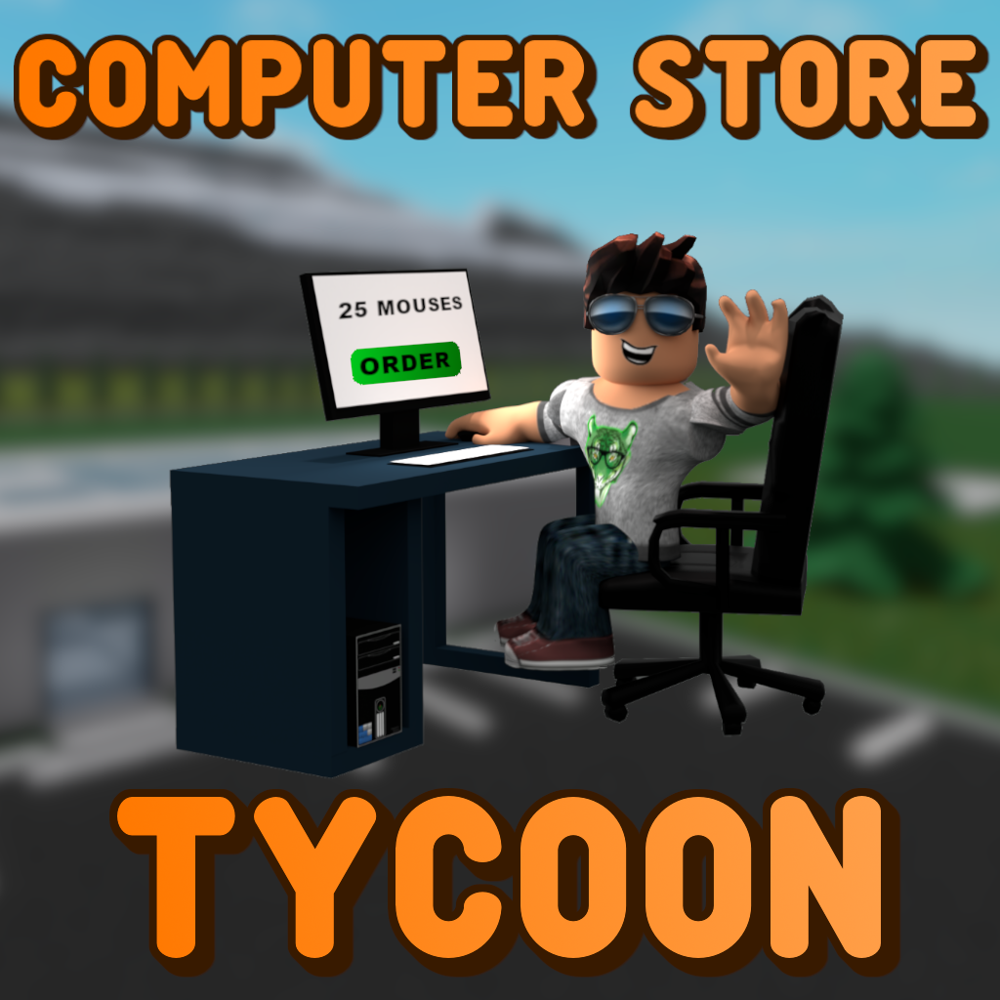
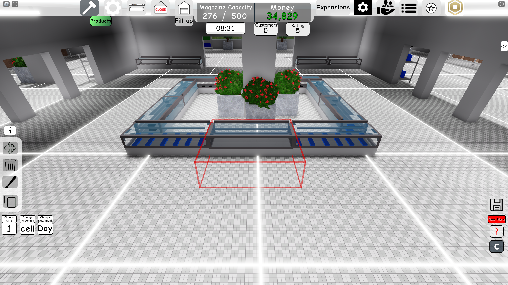
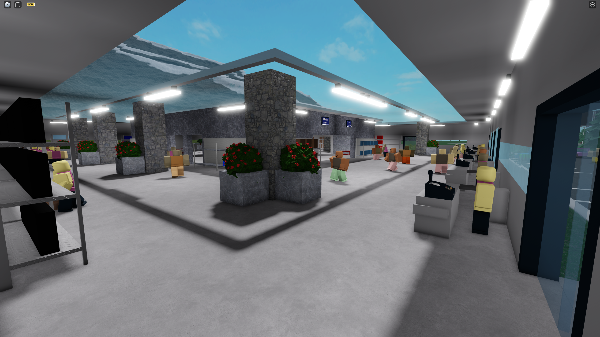

## Table of contents

- [General info](#general-info)
- [Showcase](#showcase)
- [Important note](#important-note)
- [Used modules](#used-modules)
- [Notes](#Notes)
  
## General info

This project is a [Computer Store Tycoon Game](https://www.roblox.com/games/5380202554) available on Roblox platfrom. Game is about building and managing retail-based computer store.

  

## Showcase

    
    

### Important note

This repository won't allow to fully recreate the game. This repository doesn't contain some modules made by other people and mostly, it doesn't contain all models, folders, events, attributes full structure and many other Roblox Studio workspace things.

## Used modules

Game contains some models/modules based on creations of other people:

- Placement module based on zblox164's "PlacementModuleV3"
- Color picker based on Stonetr03 Studios's "Color Picker"
- Feedback system based on MrSprinkleToes's "Feedback System"
- Daily reward system based on Sub2HTR (HowToRoblox)'s "Daily Rewards"

## Notes

This was my first major project. I started it when I was 15. It took three years to finish the project. As it was my first project, you may notice some very ugly code sections, as well as many mistakes and suboptimal solutions. However, I wanted to finish this project before preparing for university and my high school exams, and the project was too big for me to address all of these issues. I hope you understand that. ;)
